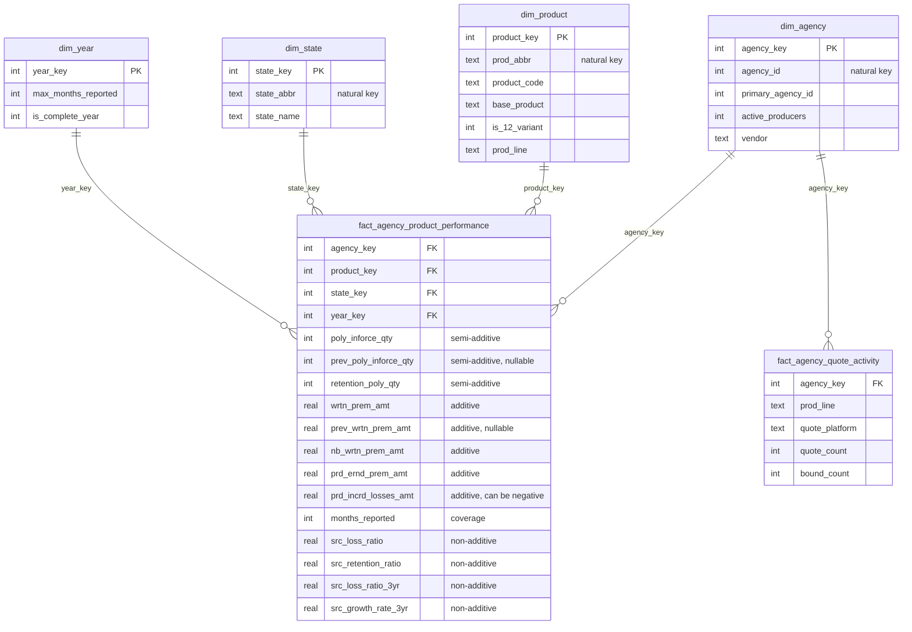

# Data Model: Insurance Agency Performance Star Schema

Proof of concept built on the public Kaggle *Insurance Agency Performance* dataset (`finalapi.csv`, 213,328 rows × 49 columns). Every design decision below is backed by a profiling query in `notebooks/01_profiling.ipynb` or a check in `sql/tests/validation_checks.sql`.

## 1. Business process and grain

| Kimball step | Decision |
|---|---|
| Business process | Annual agency production and loss results, reported by product and state |
| Grain (main fact) | **One row per agency × product × state × reporting year** |
| Grain proof | `GROUP BY` the four keys `HAVING COUNT(*) > 1` returns 0 rows; distinct keys = 213,328 = total rows |
| Dimensions | agency, product, state, year |
| Facts | premium, losses, policy counts (main fact); quote/bound counts (separate fact) |

## 2. Star schema

| Table | Rows | Key |
|---|---|---|
| `dim_year` | 11 | `year_key` = the year (smart key) |
| `dim_state` | 6 | surrogate `state_key`; natural key `state_abbr` |
| `dim_product` | 28 | surrogate `product_key`; natural key `prod_abbr` |
| `dim_agency` | 1,623 | surrogate `agency_key`; natural key `agency_id` |
| `fact_agency_product_performance` | 213,328 | composite PK of the four dimension keys |
| `fact_agency_quote_activity` | 5,722 | agency × product line × quote platform |

**Why surrogate keys?** They decouple the warehouse from source codes (e.g. `'ANNIV   12'` with padding) and give small integer joins. The natural keys are kept as `UNIQUE` columns for traceability.

## 3. Key design decisions

| # | Finding (tested) | Decision |
|---|---|---|
| 1 | All agency attributes are identical on every row of an agency across all 11 years | `dim_agency` has one row per agency. **No SCD Type 2**, because the source has no history. Limitation: attributes such as `active_producers` are a single snapshot, not the value in a given year |
| 2 | The 16 quote/bound columns are identical on every row of an agency (e.g. agency 3: 44 rows × 288 = 12,672 if summed, true value 288) | Moved to `fact_agency_quote_activity` at their real grain, unpivoted to one row per platform. Keeping them in the main fact would inflate every `SUM` |
| 3 | The five `…12` product codes co-exist with their base product for the same agency/state/year (5,615 cases) and only appear from 2012 | Kept as separate products. `base_product` and `is_12_variant` allow deliberate roll-ups |
| 4 | `MONTHS` varies by row; max is 8 in 2005 and 5 in 2015 | `months_reported` kept in the fact; `dim_year.is_complete_year` flags 2005 and 2015 as partial. Trend comparisons should use 2006–2014 |
| 5 | Stored `LOSS_RATIO` differs from `losses / earned premium` on ~31% of rows | Stored ratios kept only as `src_*` for row-level reference. All aggregate ratios are **recalculated** from amounts |
| 6 | Stored `RETENTION_RATIO` = `RETENTION_POLY_QTY / PREV_POLY_INFORCE_QTY` exactly on every valid row | Retention is recalculated from the two counts (validation check #15) |
| 7 | Negative incurred losses on 7,294 rows; negative written premium on 4,796 rows | Kept. These are consistent with recoveries, reserve releases, cancellations and return premium. Not treated as errors |

## 4. `99999` handling (column by column)

| Column(s) | Rows with 99999 | Interpretation | Treatment |
|---|---|---|---|
| `PREV_POLY_INFORCE_QTY`, `PREV_WRTN_PREM_AMT` | 13,893 (same rows) | No prior-year value available (12,857 have no prior-year row at all) | → NULL |
| `NB_WRTN_PREM_AMT` | 1 | Plausible real amount ($99,999 new business on $267,009 written) | **Kept as value** |
| `RETENTION_RATIO`, `LOSS_RATIO`, `LOSS_RATIO_3YR`, `GROWTH_RATE_3YR` | 23–61% | Ratio not computable (e.g. zero denominator) | → NULL |
| `PRIMARY_AGENCY_ID` | 37,874 | No primary/parent agency recorded | → NULL |
| Agency attributes (appointment year, producers, ages) | 5,639 (same rows) | Attribute not recorded for that agency | → NULL |
| `*_START_YEAR`, `*_END_YEAR` | 38–98% | System never used / not ended | → NULL |
| Quote/bound counts | CL 98,689 rows, PL 57,444 rows | Platform data not available for that agency | → NULL; rows with both counts missing are not loaded |

## 5. Column classification and source-to-target mapping

**Types:** ID = identifier · ATTR = dimension attribute · ADD = additive · SEMI = semi-additive (not across years) · NON = non-additive · DQ = data-quality / coverage.

| Source column | Type | Target | Transformation |
|---|---|---|---|
| `AGENCY_ID` | ID | `dim_agency.agency_id` → `agency_key` | CAST INTEGER |
| `PRIMARY_AGENCY_ID` | ATTR | `dim_agency.primary_agency_id` | CAST, 99999 → NULL |
| `PROD_ABBR` | ID | `dim_product.prod_abbr` → `product_key` | as-is; `product_code` collapses spaces |
| `PROD_LINE` | ATTR | `dim_product.prod_line`, `prod_line_name` | as-is + decoded name |
| `STATE_ABBR` | ID | `dim_state.state_abbr` → `state_key` | as-is + `state_name` |
| `STAT_PROFILE_DATE_YEAR` | ID | `dim_year.year_key` / fact `year_key` | CAST INTEGER |
| `POLY_INFORCE_QTY` | SEMI | fact `poly_inforce_qty` | CAST INTEGER |
| `PREV_POLY_INFORCE_QTY` | SEMI | fact `prev_poly_inforce_qty` | CAST, 99999 → NULL |
| `RETENTION_POLY_QTY` | SEMI | fact `retention_poly_qty` | CAST INTEGER |
| `WRTN_PREM_AMT` | ADD | fact `wrtn_prem_amt` | CAST REAL |
| `PREV_WRTN_PREM_AMT` | ADD | fact `prev_wrtn_prem_amt` | CAST, 99999 → NULL |
| `NB_WRTN_PREM_AMT` | ADD | fact `nb_wrtn_prem_amt` | CAST REAL (99999 kept) |
| `PRD_ERND_PREM_AMT` | ADD | fact `prd_ernd_prem_amt` | CAST REAL |
| `PRD_INCRD_LOSSES_AMT` | ADD | fact `prd_incrd_losses_amt` | CAST REAL, negatives kept |
| `MONTHS` | DQ | fact `months_reported`; `dim_year.max_months_reported` | CAST INTEGER |
| `RETENTION_RATIO` | NON | fact `src_retention_ratio` | CAST, 99999 → NULL |
| `LOSS_RATIO` | NON | fact `src_loss_ratio` | CAST, 99999 → NULL |
| `LOSS_RATIO_3YR` | NON | fact `src_loss_ratio_3yr` | CAST, 99999 → NULL |
| `GROWTH_RATE_3YR` | NON | fact `src_growth_rate_3yr` | CAST, 99999 → NULL |
| `AGENCY_APPOINTMENT_YEAR` | ATTR | `dim_agency.agency_appointment_year` | CAST, 99999 → NULL |
| `ACTIVE_PRODUCERS` | ATTR | `dim_agency.active_producers` | CAST, 99999 → NULL |
| `MAX_AGE`, `MIN_AGE` | ATTR | `dim_agency.max_producer_age`, `min_producer_age` | CAST, 99999 → NULL |
| `VENDOR_IND`, `VENDOR` | ATTR | `dim_agency.vendor_ind`, `vendor` | as-is |
| `PL_/CL_/COMMISIONS_/ACTIVITY_NOTES_ START/END_YEAR` (8) | ATTR | `dim_agency.*_start_year`, `*_end_year` | CAST, 99999 → NULL |
| `CL_QUO_CT_*`, `CL_BOUND_CT_*` (MDS, SBZ, eQT) | ADD (agency grain) | `fact_agency_quote_activity` (`prod_line='CL'`) | unpivot, 99999 → NULL |
| `PL_QUO_CT_*`, `PL_BOUND_CT_*` (ELINKS, PLRANK, eQTte, APPLIED, TRANSACTNOW) | ADD (agency grain) | `fact_agency_quote_activity` (`prod_line='PL'`) | unpivot, 99999 → NULL |

## 6. How double counting is prevented

1. **Snapshot values live at their own grain.** Quote/bound counts sit in `fact_agency_quote_activity` (one row per agency and platform), and agency attributes sit in `dim_agency` (one row per agency). Neither is repeated on product rows.
2. **Ratios are never stored as aggregatable facts.** Aggregate loss ratio = `SUM(prd_incrd_losses_amt) / NULLIF(SUM(prd_ernd_prem_amt), 0)`.
3. **Policy counts are summed within a year only.** Summing `poly_inforce_qty` across years counts the same policy repeatedly.
4. **Validation checks** (`sql/tests/validation_checks.sql`) reconcile row counts and totals against staging on every build.

## 7. Known limitations

- The dataset has no documentation for several columns. Interpretations of `…12` products, `MONTHS`, and the start/end year columns are inferred from the data, not confirmed.
- Agency attributes and quote counts are single snapshots with no period stated.
- 2005 and 2015 are partial years.
- Producer age values include implausible minimums (e.g. 11). Left as delivered, flagged here.
